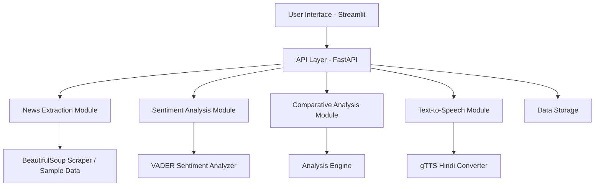

t# News Sentiment Analysis with Hindi TTS


## Table of Contents

1. [Project Overview](#project-overview)
2. [Features](#features)
3. [Technical Architecture](#technical-architecture)
4. [Project Structure](#project-structure)
5. [Installation](#installation)
6. [Running the Application](#running-the-application)
7. [API Documentation](#api-documentation)
8. [Component Details](#component-details)
   - [News Extraction](#news-extraction)
   - [Sentiment Analysis](#sentiment-analysis)
   - [Comparative Analysis](#comparative-analysis)
   - [Text-to-Speech](#text-to-speech)
   - [User Interface](#user-interface)
9. [Sample Output](#sample-output)
10. [Deployment](#deployment)
11. [Testing](#testing)
12. [Known Issues](#known-issues)
13. [Future Improvements](#future-improvements)
14. [Contributing](#contributing)
15. [License](#license)
16. [Contact](#contact)

## Project Overview

This project is a web-based application that extracts key details from multiple news articles related to a given company, performs sentiment analysis, conducts a comparative analysis, and generates a text-to-speech (TTS) output in Hindi. The tool allows users to input a company name and receive a structured sentiment report along with an audio output.

The application provides insights into how a company is portrayed across different news sources, helping users understand the overall sentiment and key topics associated with the company in recent news coverage.

## Features

- **News Extraction**: Extracts title, summary, and metadata from news articles related to a company
- **Sentiment Analysis**: Analyzes sentiment (positive, negative, neutral) of article content
- **Comparative Analysis**: Compares sentiment across articles to derive insights
- **Topic Identification**: Extracts key topics from each article
- **Text-to-Speech**: Converts the summarized content into Hindi speech
- **User Interface**: Simple web-based interface using Streamlit
- **API Development**: Communication between frontend and backend via RESTful APIs
- **Deployment Ready**: Configured for deployment on Hugging Face Spaces

## Technical Architecture

The application follows a client-server architecture with the following components:



- **Frontend**: Streamlit-based web interface
- **Backend**: FastAPI-based RESTful API
- **Processing Modules**: Specialized modules for each functionality
- **Data Storage**: Local file-based storage for results and audio files

## Project Structure

```
news-sentiment-app/
├── app.py                 # Streamlit frontend application
├── api.py                 # FastAPI backend endpoints
├── utils.py               # Utility functions for news extraction, sentiment analysis, etc.
├── simple_app.py          # Simplified Streamlit app (alternative version)
├── huggingface_app.py     # Combined app for Hugging Face deployment
├── requirements.txt       # Dependencies
├── packages.txt           # System dependencies for Hugging Face
├── README.md              # Documentation
├── .gitignore             # Git ignore file
├── run_app.sh             # Script to run the app locally
├── run_tests.sh           # Script to run tests
├── deploy_to_huggingface.sh # Script for Hugging Face deployment
├── test_app.py            # Unit tests
├── models/                # Directory for model files (if any)
└── data/                  # Directory for data storage
```

## Installation

### Prerequisites

- Python 3.8+
- pip (Python package manager)
- ffmpeg (for audio processing)

### Step-by-Step Installation

1. Clone the repository:
   ```bash
   git clone https://github.com/yourusername/news-sentiment-analysis.git
   cd news-sentiment-analysis
   ```

2. Create a virtual environment (optional but recommended):
   ```bash
   python -m venv venv
   source venv/bin/activate  # On Windows: venv\Scripts\activate
   ```

3. Install dependencies:
   ```bash
   pip install -r requirements.txt
   ```

4. Download NLTK resources (this happens automatically on first run, but you can do it manually):
   ```python
   import nltk
   nltk.download('vader_lexicon')
   nltk.download('punkt')
   nltk.download('stopwords')
   ```

5. Create necessary directories:
   ```bash
   mkdir -p data models
   ```

## Running the Application

### Using the Run Script

The easiest way to run the application is using the provided script:

```bash
chmod +x run_app.sh  # Make the script executable (first time only)
./run_app.sh
```

This script will:
- Check if Python is installed
- Install required packages if needed
- Create the data directory if it doesn't exist
- Download NLTK resources if needed
- Start the FastAPI backend
- Start the Streamlit frontend

### Manual Startup

Alternatively, you can start the components manually:

1. Start the FastAPI backend:
   ```bash
   uvicorn api:app --reload --host 0.0.0.0 --port 8000
   ```

2. In a separate terminal, start the Streamlit frontend:
   ```bash
   streamlit run app.py
   ```

3. For a simplified version (without separate backend):
   ```bash
   streamlit run simple_app.py
   ```

### Accessing the Application

Once running, you can access:
- Frontend: http://localhost:8501
- API Documentation: http://localhost:8000/docs

## API Documentation

The application provides a RESTful API for communication between the frontend and backend.

### Endpoints

#### `POST /api/analyze`

Start analysis of news articles for a company.

**Request Body**:
```json
{
  "company_name": "Tesla",
  "num_articles": 10
}
```

**Response**:
```json
{
  "request_id": "uuid-string",
  "status": "processing",
  "message": "Processing news for Tesla"
}
```

#### `GET /api/status/{request_id}`

Get the status of an analysis request.

**Response**:
```json
{
  "status": "processing|completed|error",
  "message": "Status message"
}
```

#### `GET /api/result/{request_id}`

Get the result of a completed analysis.

**Response**:
```json
{
  "company": "Tesla",
  "articles": [
    {
      "title": "Article Title",
      "summary": "Article Summary",
      "sentiment": "Positive|Negative|Neutral",
      "topics": ["Topic1", "Topic2"],
      "url": "Article URL",
      "source": "Source Name",
      "date": "Publication Date"
    }
  ],
  "comparative_sentiment_score": {
    "sentiment_distribution": {
      "Positive": 5,
      "Negative": 3,
      "Neutral": 2
    },
    "coverage_differences": [
      {
        "comparison": "Comparison text",
        "impact": "Impact description"
      }
    ],
    "topic_overlap": {
      "common_topics": ["Topic1", "Topic2"],
      "unique_topics": ["Topic3", "Topic4"]
    }
  },
  "final_sentiment_analysis": "Final analysis text",
  "audio": "Path to audio file"
}
```

#### `GET /api/companies`

Get a list of example companies for the dropdown.

**Response**:
```json
{
  "companies": ["Tesla", "Apple", "Microsoft", "Google", "Amazon"]
}
```

#### `GET /api/audio/{request_id}`

Get the audio file for a completed analysis.

**Response**:
```json
{
  "audio_url": "Path to audio file"
}
```

#### `GET /api/health`

Health check endpoint.

**Response**:
```json
{
  "status": "ok",
  "timestamp": 1648123456.789
}
```

### Using the API with Postman

1. Start the analysis:
   - Method: POST
   - URL: http://localhost:8000/api/analyze
   - Body (JSON): `{"company_name": "Tesla", "num_articles": 10}`

2. Check the status:
   - Method: GET
   - URL: http://localhost:8000/api/status/{request_id}

3. Get the results:
   - Method: GET
   - URL: http://localhost:8000/api/result/{request_id}

## Component Details

### News Extraction

The news extraction module is responsible for finding and extracting content from news articles related to a specified company.

#### Implementation

In the current implementation, we use a sample data generator for demonstration purposes. This approach was chosen due to the challenges with real-time web scraping, such as:
- Websites blocking scraping attempts
- Changing website structures
- Rate limiting
- Network issues

In a production environment, you would use:
- A news API like NewsAPI, GNews, or similar
- More robust web scraping with rotating proxies and user agents
- Proper error handling and retry mechanisms

#### Key Functions

- `search_news_articles(company_name, num_articles)`: Finds news articles related to a company
- `extract_article_content(url, source)`: Extracts content from a news article URL

### Sentiment Analysis

The sentiment analysis module analyzes the sentiment of article content to determine if it's positive, negative, or neutral.

#### Implementation

We use VADER (Valence Aware Dictionary and sEntiment Reasoner) from NLTK for sentiment analysis. VADER is particularly well-suited for social media text and short texts like news headlines.

#### Sentiment Classification

- **Positive**: compound score >= 0.05
- **Negative**: compound score <= -0.05
- **Neutral**: -0.05 < compound score < 0.05

#### Key Functions

- `analyze_sentiment(text)`: Analyzes the sentiment of a text and returns scores and category

### Comparative Analysis

The comparative analysis module compares sentiment and topics across multiple articles to derive insights.

#### Implementation

The module:
1. Calculates sentiment distribution across articles
2. Identifies common and unique topics
3. Generates insights on coverage differences
4. Determines the dominant sentiment

#### Key Functions

- `perform_comparative_analysis(articles)`: Performs comparative analysis across multiple articles
- `extract_topics(text, n_topics)`: Extracts main topics from text using TF-IDF

### Text-to-Speech

The text-to-speech module converts the summarized content into Hindi speech.

#### Implementation

We use gTTS (Google Text-to-Speech) for Hindi conversion. The module:
1. Generates a summary of the analysis results
2. Translates the summary to Hindi (basic implementation)
3. Converts the Hindi text to speech
4. Saves the audio file for playback

#### Key Functions

- `generate_hindi_tts(text, output_file)`: Generates Hindi text-to-speech audio
- `translate_to_hindi(text)`: Translates text to Hindi using a simple approach
- `generate_summary_for_tts(analysis_result)`: Generates a summary text for TTS conversion

### User Interface

The user interface is built with Streamlit, providing a clean and intuitive way to interact with the application.

#### Features

- Free-form company name input (enter any company name)
- Number of articles slider
- Progress tracking during analysis
- Tabbed interface for results:
  - Articles tab: Displays article details
  - Comparative Analysis tab: Shows sentiment distribution and topic analysis
  - Hindi TTS tab: Provides audio playback

#### Implementation

The UI is implemented in `app.py` (full version) and `simple_app.py` (simplified version).

## Sample Output

### Example Input

Company Name: Tesla

### Example Output

```json
{
  "company": "Tesla",
  "articles": [
    {
      "title": "Tesla's New Model Breaks Sales Records",
      "summary": "Tesla's latest EV sees record sales in Q3...",
      "sentiment": "Positive",
      "topics": ["Electric Vehicles", "Stock Market", "Innovation"]
    },
    {
      "title": "Regulatory Scrutiny on Tesla's Self-Driving Tech",
      "summary": "Regulators have raised concerns over Tesla's self-driving software...",
      "sentiment": "Negative",
      "topics": ["Regulations", "Autonomous Vehicles"]
    }
  ],
  "comparative_sentiment_score": {
    "sentiment_distribution": {
      "Positive": 1,
      "Negative": 1,
      "Neutral": 0
    },
    "coverage_differences": [
      {
        "comparison": "Articles with positive sentiment focus on different aspects than negative ones.",
        "impact": "This contrast highlights the polarized coverage of the company."
      }
    ],
    "topic_overlap": {
      "common_topics": ["Electric Vehicles"],
      "unique_topics": ["Stock Market", "Innovation", "Regulations", "Autonomous Vehicles"]
    }
  },
  "final_sentiment_analysis": "Tesla's latest news coverage is mixed with equal positive and negative articles.",
  "audio": "data/tesla_summary.mp3"
}
```

## Deployment

### Deploying to Hugging Face Spaces

The application is configured for deployment on Hugging Face Spaces, a platform for hosting machine learning demos.

#### Prerequisites

- Hugging Face account
- Git

#### Deployment Steps

1. Run the deployment script:
   ```bash
   chmod +x deploy_to_huggingface.sh  # Make the script executable (first time only)
   ./deploy_to_huggingface.sh
   ```

2. Follow the prompts to enter your Hugging Face username and space name.

3. The script will:
   - Create a temporary directory for deployment
   - Copy necessary files
   - Initialize a Git repository
   - Create a Hugging Face Space
   - Push the code to the Space

4. Your application will be available at:
   `https://huggingface.co/spaces/yourusername/your-space-name`

### Manual Deployment

1. Create a new Space on Hugging Face:
   - Go to https://huggingface.co/spaces
   - Click "Create new Space"
   - Select "Streamlit" as the SDK
   - Fill in the details and create the Space

2. Prepare your repository:
   - Copy `huggingface_app.py` to `app.py`
   - Ensure `requirements.txt` and `packages.txt` are up to date

3. Push your code to the Hugging Face Space:
   ```bash
   git remote add space https://huggingface.co/spaces/yourusername/your-space-name
   git push space main
   ```

## Testing

The application includes unit tests to verify the functionality of key components.

### Running Tests

```bash
chmod +x run_tests.sh  # Make the script executable (first time only)
./run_tests.sh
```

or

```bash
python -m unittest test_app.py
```

### Test Coverage

The tests cover:
- Sentiment analysis functionality
- Topic extraction
- Comparative analysis
- Hindi translation
- Summary generation

## Known Issues

1. **Web Scraping Limitations**:
   - The current implementation uses sample data instead of real-time scraping
   - In a production environment, you would need a more robust solution

2. **Hindi Translation**:
   - The translation is basic and may not be grammatically perfect
   - A proper translation API would be needed for production use

3. **TensorFlow and PyTorch Warnings**:
   - The application may show warnings related to TensorFlow and PyTorch
   - These are non-critical and don't affect functionality

4. **Performance**:
   - Processing many articles can be slow
   - Caching mechanisms would improve performance in production

## Future Improvements

1. **News Extraction**:
   - Integrate a proper news API for real-time article extraction
   - Implement more robust web scraping with rotating proxies

2. **Sentiment Analysis**:
   - Implement a more sophisticated sentiment analysis model using transformers
   - Fine-tune the model for financial news

3. **Translation**:
   - Use a proper translation API for better Hindi conversion
   - Add support for more languages

4. **Performance**:
   - Implement caching to improve performance
   - Optimize the processing pipeline

5. **User Experience**:
   - Add user authentication for personalized results
   - Enhance the UI with more interactive visualizations
   - Implement historical tracking of sentiment over time

6. **Deployment**:
   - Add containerization with Docker
   - Implement CI/CD pipeline

## Contributing

Contributions are welcome! Please feel free to submit a Pull Request.

1. Fork the repository
2. Create your feature branch (`git checkout -b feature/amazing-feature`)
3. Commit your changes (`git commit -m 'Add some amazing feature'`)
4. Push to the branch (`git push origin feature/amazing-feature`)
5. Open a Pull Request

## License

This project is licensed under the MIT License - see the LICENSE file for details.

## Contact

For any questions or feedback, please contact [your-email@example.com](mailto:your-email@example.com).

---

*This project was developed as part of an assignment to demonstrate skills in web development, natural language processing, and API development.*
